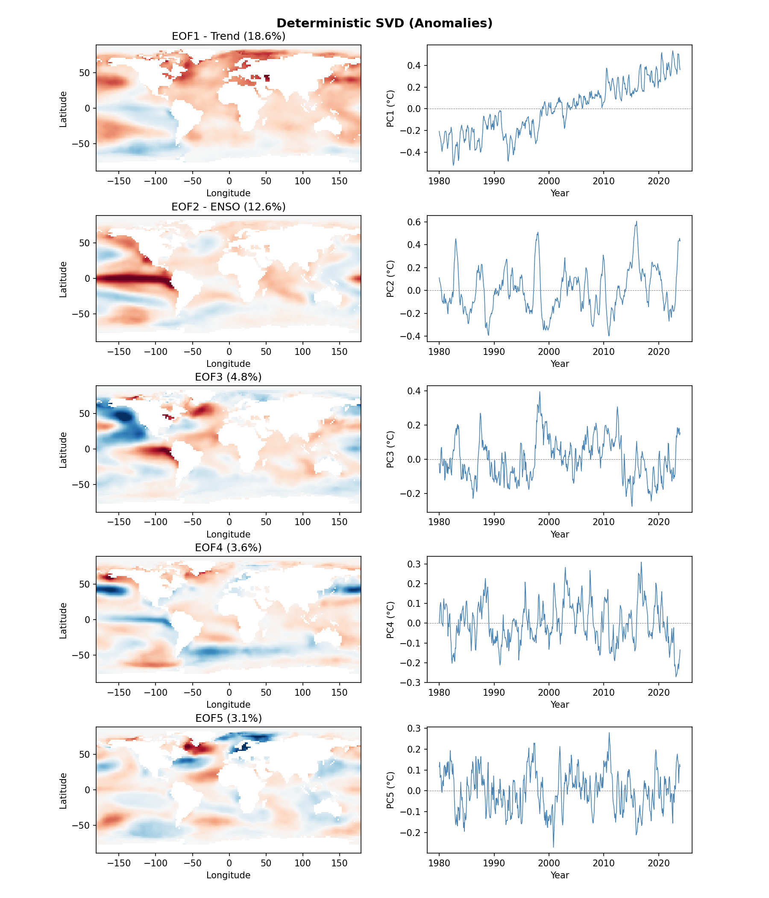
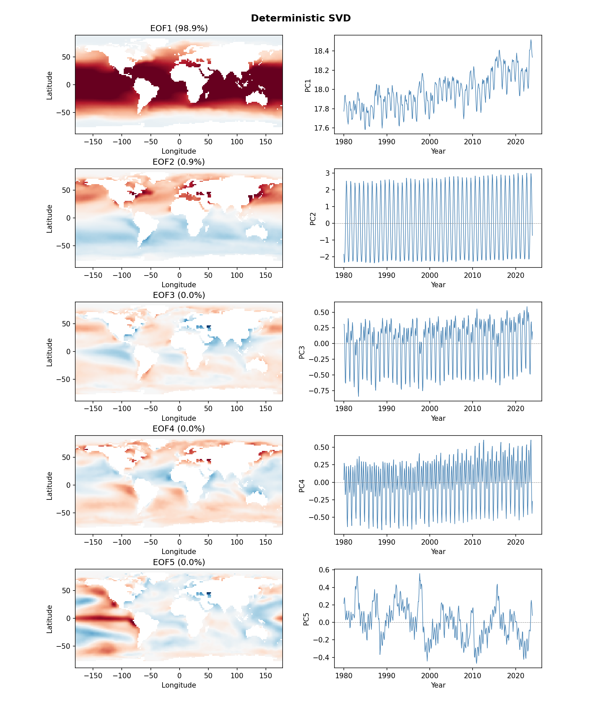

# Climate Analysis Examples

EOF/SVD analysis of NOAA Sea Surface Temperature (SST) data using randomized SVD.

## References

- [SketchySVD (IPAM)](https://helper.ipam.ucla.edu/publications/glws3/glws3_15459.pdf)
- [Video Lecture](https://www.youtube.com/watch?v=3P6_zk6FbmE)

## Data

NOAA ERSST v5 monthly SST data (2° resolution, 1980-2023).

Download:
```bash
python download_sst_data.py   # or .m / .jl
```

## Analysis Scripts

### test_sst_modes (Raw SST)

Applies SVD to raw SST values. Dominant modes:

| Mode | Variance | Description |
|------|----------|-------------|
| EOF1 | 98.9% | Mean spatial pattern (warm tropics, cold poles) |
| EOF2-4 | ~1% | Seasonal variations |
| EOF5 | <0.1% | ENSO signal |

### test_sst_anomaly (SST Anomalies)

Applies SVD to SST anomalies (deviation from monthly climatology). Dominant modes:

| Mode | Variance | Description |
|------|----------|-------------|
| EOF1 | 18.6% | Long-term trend (global warming signal) |
| EOF2 | 12.6% | ENSO (El Niño-Southern Oscillation) |
| EOF3 | 4.8% | PDO (Pacific Decadal Oscillation) |

## Sign Convention

EOF signs are arbitrary in SVD. We use a reconstruction-based convention:

```
mean(U[:,i]) > 0
```

This ensures:
- Spatial pattern has positive mean over ocean
- Positive PC = positive anomaly contribution
- For trend mode: upward PC = warming

## Mathematical Verification

The temporal signals (PC) plotted correspond exactly to the SVD reconstruction:

```
A_k = Σᵢ₌₁ᵏ σᵢ uᵢ vᵢᵀ
```

Where:
- `uᵢ` = spatial pattern (EOF)
- `vᵢ` = temporal pattern
- `PCᵢ(t) = uᵢᵀ A(:,t) / √n = σᵢ vᵢ(t) / √n`

Each mode reduces the approximation residual:
```
||A - A_k||² = Σᵢ₌ₖ₊₁ σᵢ²
```

## Output


*EOF analysis of SST anomalies showing warming trend (EOF1) and ENSO (EOF2)*


*EOF analysis of raw SST showing mean pattern (EOF1) and seasonal cycles (EOF2-4)*

## Languages

Identical implementations in Python, MATLAB, and Julia.
