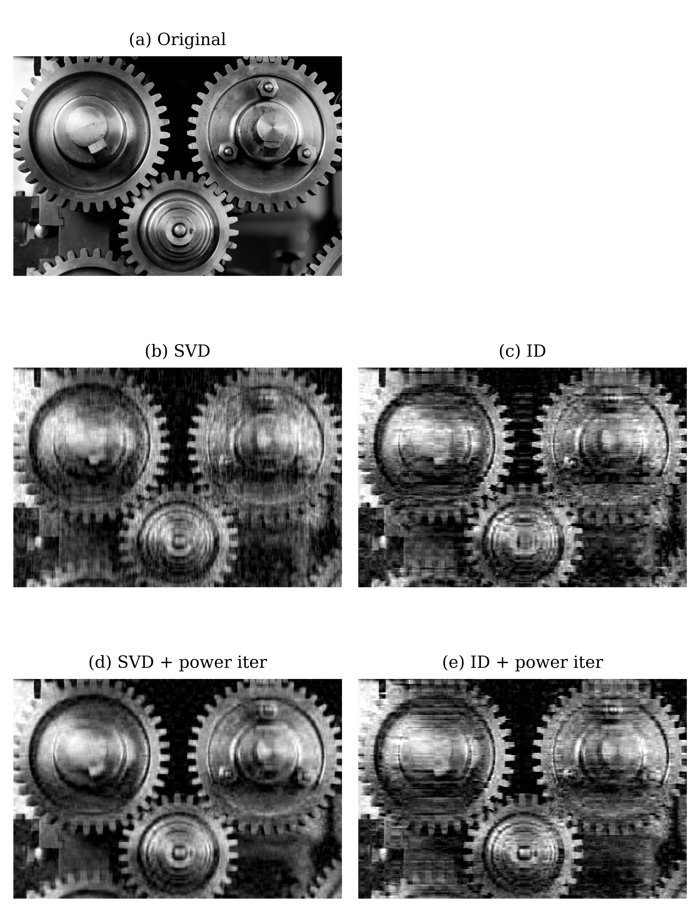

# Summary

Randomized linear algebra algorithms have become a vital tool for a variety of areas including fast direct solvers, reduced order modeling, and data science.   Additionally, randomized linear algebra provides useful tools for solving total least squares problems, rank deficient least squares problem, doing matrix approximation, and skeletonizing (i.e. subset selection) a matrix [@Chan:1992].  'librla' provides low rank QR factorizations, SVDs and interpolatory decompositions written natively in Python, Julia and Matlab.  The algorithms ramdomly sampling the range of the matrix or operator a similar manner to '[@Halko:2011]'. A key feature of this package is that it is designed to exploit Level 3 BLAS operators as much as possible.  'librla' is designed for small to mid-range sized matrices (i.e. up to roughly 10,000 in size depending on computing resources).  'librla' is not intendend for matrices that are larger or need to read from hard drive.  

'librla' includes the following options all of which can be used for both real and complex matrices: 

- 'qr_sketch': Randomized QR factorization.
- 'svd_sketch': Randomized Singular Value Decomposition (SVD)
- 'id_sketch': Interpolatory Decomposition via randomized sampling.

The user has the choice of specifying a tolerance or a desired rank.  The package does include the option to create low rank factorizations of matrices that are applied via matrix vector multiplication codes.  'librla' requires both the ability to apply both the matrix and its transpose via a subroutine.  If only application of the matrix is available, 
'librla' will not work.

For each method, the user has the option to change the block size for the sampling and to turn on the power option.  The default are block sizes that are multiples of 42 and power option off.

While the algorithm used in 'librla' is built in a similar manner to the randomized methods in  [@Halko:2011,@Liberty:2007], there is a large collection of related work [Duersch:2020,Mahoney:2009,MEIER:2024,Martinsson:2019,Sorensen:2016,Gu:1996].  

# Statement of need

While there is a large amount of research activity in the field of randomized linear algebra, there is not an easy to use and stable factorization library available.  The need is even greater for those using high level languages where standard coding techniques can result in an unnecessarily slow code.  The area of fast direct solvers for integral equations is an example of why 'librla' is useful.  For sometime, developers of fast direct solvers using Matlab have been using a Fortran package [@Tygert:2008] based on [@Liberty:2007] via a specialized wrapper.  The need of this wrapper has slowed the design and use of these solvers.  

There are two available related routines available in widely avaible Python packages.  They are Pytorch's 'svd_lowrank' and Scipy's 'id_decomp' found in the 'scipy.linalg.interpolative' library.  Codes allowing the user compare the performance are avialble in the *compare* folder of the repository.  The results show that the performance of 'liblra' is comparable to that of the Pytorch svd and is faster than the interpolatory decomposition 'id_decomp'.  The library 'librla' is the only package that provides the user the option of three different factorizations.  The factozation speeds are all comparable to Pytorch's 'svd_lowrank'.  

# Mathematics

The algorithm that serves as the foundations of 'librla' is called 'orth_sketch' . It creates an orthogonal basis of the range of the operator of interest.  The algorithm was heavily influenced by the method presented in [@Halko:2011],  [@Tygert:2008] and [@Liberty:2007]. Once this basis is created it is possible to create the low rank QR, SVD or interpolatory decomposition via standard techniques.  For simplicity of presentation, a pseudocode of 'orth_sketch' is presented here. 

## Pseudocode

**Input:** the operator $\bf{A}$ of size $m\times n$, stopping tolerance $rtol$

**Output:** an orthonormal matrix $\bf{Q}$ of size ($m \times k$) spanning approximate range of $\bf{A}$, a vector $\bf{diagR}$ containing the diagonal elements from a pivoted QR factorization which can be used to create rough error estimates

**Blocking loop**

Let '$\Omega$' denote a random matrix of size $n\times 42$.
Set $y = \bf{A} \bf{\Omega}.
Define $\bf{Q}\bf{R}$ to be the matrices that result from the QR factorization of $y$.

% Check tolerance
diagR = abs(diag(R));
if isempty(diagR) || diagR(1) == 0
          d = 0.0;
      else
          d = diagR(end) / diagR(1);
      end
      if d <= rtol
          flag = 0;
          return;
      end

  var num = number;
  IF (num % 2 === 0)
    THEN Print "even";
    ELSE Print "odd";
  ENDIF;
END.

# Demo codes

The file named *demo* located in each of the language files provides a collection of codes that demonstrate how to call the factorizations in 'librla' with the different options.  These 'demo_' codes are designed to aid users.   The codes in the *demo* directory named 'test_' validate that the codes are working correctly.  The code 'test_all' test all the factorization techniques while the other test codes are written to test one factorization technique.  

# Examples from the literature

To illustrate the ability of the library handle problems of interest, the techniques are applied to two problems found in recent papers.  The problems investigated are using low rank factorizations for image compression and data compression [@Tropp:2019]. 

The image compression example produces 6 images is illustrated in Figure \cite{fig:image_orig}.  The first row illustrates (a) the original image and the rank 120 approximation using both (b) the SVD and (c) the interpolatory docomposition.  Note that while the rank of the approximations are the same, the interpolatory decomposition has smearing in the image.  The second row illustrates the approximations from using the three different rank 120 factorizations with oversampling and two iterations of the power method.  The approximations are improvied by b

{width=100%}

Figures \cite{fig:climate_SVD} and \ref{fig:climate_singular} replicate an experiment from [@Tropp:2019].  Figure \ref{fig:climate_SVD} illustrates the approximations generated using the randomized SVD.  Figure \ref{fig:climate_singular} illustrates the 

![Illustration of the approximation using the randomized SVD to approximate the data from [@Tropp:2019]  \label{fig:climate_SVD}](Randomized_SVD.png){width=100%}

![Illustration of singular values and the approximate singular values resulting from the randomized SVD of a data matrix from [@Tropp:2019]  \label{fig:climate_singular}](Singular_Values.png){width=100%}

# Acknowledgements

The work by A. Gillman was supported by the National Science Foundation (DMS-2110886), and a 
Knut and Alice Wallenberg Foundation Grant. Part of this work was carried out while A. Gillman
was in residence at Institut Mittag-Leffler in Djursholm, Sweden in autumn 2025, supported by the
Swedish Research Council under grant no. 2021-06594.

# References
