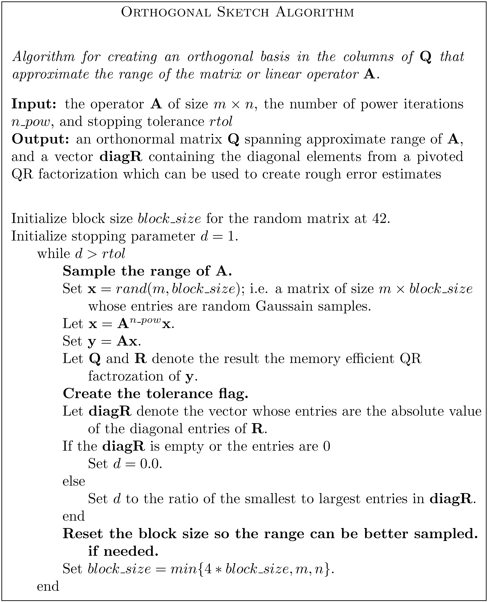

# Summary

Randomized linear algebra algorithms have become a vital tool for a variety of areas including fast direct solvers, reduced order modeling, and data science.   Additionally, randomized linear algebra provides useful tools for solving total least squares problems, rank deficient least squares problem, doing matrix approximation, and skeletonizing (i.e. subset selection) a matrix [@Chan:1992].  'librla' provides low rank QR factorizations, SVDs and interpolatory decompositions written natively in Python, Julia and Matlab.  The algorithms ramdomly sampling the range of the matrix or operator a similar manner to '[@Halko:2011]'. A key feature of this package is that it is designed to exploit Level 3 BLAS operators as much as possible.  'librla' is designed for small to mid-range sized matrices (i.e. up to roughly 10,000 in size depending on computing resources).  'librla' is not intendend for matrices that are larger or need to read from hard drive.  

'librla' includes the following options all of which can be used for both real and complex matrices: 

- 'qr_sketch': Randomized QR factorization.
- 'svd_sketch': Randomized Singular Value Decomposition (SVD)
- 'id_sketch': Interpolatory Decomposition via randomized sampling.

The user has the choice of specifying a tolerance or a desired rank.  The package does include the option to create low rank factorizations of matrices that are applied via matrix vector multiplication codes. In order to use this option, 'librla' requires both the ability to apply both the matrix and its transpose via a subroutine.  

For each method, the user has the option to change the block size for the sampling and to use the power iteration.  The default settings are block sizes that are multiples of 42 and the power iteration option turned off.

While the algorithm used in 'librla' is built in a similar manner to the randomized methods in  [@Halko:2011,@Liberty:2007], there is a large collection of related work [Duersch:2020,Mahoney:2009,MEIER:2024,Martinsson:2019,Sorensen:2016,Gu:1996].  

# Statement of need

While there is a large amount of research activity in the field of randomized linear algebra, there is not an easy to use and stable factorization library available.  The need is even greater for those using high level languages where standard coding techniques can result in an unnecessarily slow code.  The research area of fast direct solvers provides an example of the need of 'librla'.  For sometime, the development and use of fast direct solvers in Matlab required a specialized wrapper on the Fortran package [@Tygert:2008] which is based on [@Liberty:2007].  The lack of portability of the wrapper has slowed the design and use of these solvers.  

Currently, there are two available related routines available in widely avaible Python packages.  They are Pytorch's 'svd_lowrank' and Scipy's 'id_decomp' found in the 'scipy.linalg.interpolative' library.  Codes allowing the user compare the performance are avialble in the *compare* folder of the repository.  The results show that the performance of 'liblra' is comparable to that of the Pytorch svd and is faster than the interpolatory decomposition 'id_decomp'.  The library 'librla' is the only package that provides the user the option of three different factorizations.  The factozation speeds are all comparable to Pytorch's 'svd_lowrank'.  

# Mathematics

The algorithm that serves as the foundations of 'librla' is called 'orth_sketch' . It creates an orthogonal basis of the range of the operator of interest.  The algorithm was heavily influenced by the method presented in [@Halko:2011],  [@Tygert:2008] and [@Liberty:2007]. Once this basis is created it is possible to create the low rank QR, SVD or interpolatory decomposition via standard techniques.  For simplicity of presentation, a pseudocode of 'orth_sketch' is presented in Figure \ref{fig:algorithm}. Roughly speaking, 'orth_sketch' randomly samples the range of a linear operator ${\bf A}$ and creates an orthogonal basis for the range.  The range is sampled in blocks that are multiples of *42* and a QR factorization is performed.  The user is able to change the sizes of the blocks sampled.  Once the ratio of diagonal entries of the upper triangular ${\bf R}$ matrix is less than the stopping tolerance 'rtol', the matrix ${\bf Q}$ is returned.  

{width=100%}

While ${\bf Q}$ is a sampling of the range, it is not necessarily the size of the final factorization.  The matrix ${\bf Q}$ is fed into the final factorization technique the produces the desired low rank factorization.  These techniques are constructed ina manner similar to [@Halko:2011].  The factorizations behave as follows when factorizing a linear operator ${\bf A}$ of size $m\times n$.

\begin{itemize}
\item {\bf 'qr\_sketch'} The subroutine returns two matrices: ${\bf Q}$ and ${\bf R}$, and a vector ${\bf p}$.  The rank of the factorization is $k$ where $k\leq \min\{m,n\}$. The $n$ entries of ${\bf p}$ are the list of the column pivots.  The matrix ${\bf Q}$ is of size $m \times k$ and the columns form an orthogonal basis for the range of ${\bf A}$.  The matrix ${\bf R}$ is an upper triangular $k\times n$ matrix. The factorization satisfies

$${\bf{A}}(:,p) \sim {\bf QR}.$$

\item {\bf 'svd\_sketch'} The subroutine returns two matrices: ${\bf U}$ and ${\bf V}$ and a vector ${\bf s}$.  The rank of the factorization is $k$ where $k\leq \min\{m,n\}$.  The vector ${\bf s}$ has $k$ entries that are the singular values of ${\bf A}$.  The matrix ${\bf U}$ is of size $m \times k$ and is contains the left singular vectors of ${\bf A}$.  The matrix ${\bf V}$ is of size $n\times k$ and contains the right singular vectors of ${\bf A}$.  The columns of both ${\bf U}$ and ${\bf V}$ are orthonormal.  The factorization satisfies

$$ {\bf A}  \sim  {\bf U}{\tt diag}({\bf s}){\bf V}^{*}.$$

\item {\bf 'id\_sketch'} The subroutine returns $k$ the number of skeleton columns, a vector ${\bf piv}$ of size $1\times n$ and a matrix ${\bf T}$ of size $k \times (n-k)$.  The first $k$ entries ${\rm piv}$ denote the skeleton columns the remaining entries remain in natural order.  The matrix ${\bf T}$ is called the interpolation matrix.  The approximation satisifes the following;

$$ {\bf A}(:, {\bf piv}(k+1:end))\sim {\bf A}(:, {\bf piv}(1:k)) {\bf T}.$$

To recover an approximation of the full matrix, first build an $k \times n$ matrix ${\bf W}$ where 
${\bf W}(:,{\bf piv}(1:k)) = {\bf I}_k$ where ${\bf I}_k$  is an identity matrix of size $k$.  Then set 
${\bf W}(:,{\bf piv}(k+1:end)) = {\bf T}$.  The result is that 

$${\bf A} \sim {\bf A}(:, {\bf piv}(1:k)) {\bf W}.$$

\end{itemize}

# Demo codes

The file named *demo* located in each of the language files provides a collection of codes that demonstrate how to call the factorizations in 'librla' with the different options.  These 'demo_' codes are designed to aid users.   The codes in the *demo* directory named 'test_' validate that the codes are working correctly.  The code 'test_all' test all the factorization techniques while the other test codes are written to test one factorization technique.  

# Examples from the literature

To illustrate the ability of the library handle problems of interest, the techniques are applied to two problems.  The first problem is an image compression problem similar to examples that are commonly found in the literature.  The second problem is a data compression problem taken directly from [@Tropp:2019]. 

The image compression example produces 6 images is illustrated in Figure \ref{fig:image_orig}.  The first row illustrates (a) the original image and the rank 120 approximation using both (b) the SVD and (c) the interpolatory docomposition.  Note that while the rank of the approximations are the same, the interpolatory decomposition has smearing in the image.  The second row illustrates the approximations from using the three different rank 120 factorizations with oversampling and two iterations of the power method.  The approximations are improvied by the oversampling and the power iteration.

{width=100%}

Figures \ref{fig:climate_SVD} and \ref{fig:climate_singular} replicate an experiment from [@Tropp:2019].  Figure \ref{fig:climate_SVD} illustrates the approximations generated using the randomized SVD.  Figure \ref{fig:climate_singular} illustrates the ability of 'svd\_sketch' to capture the singular values of a matrix. 

![Illustration of the approximation using the randomized SVD to approximate the data from [@Tropp:2019]  \label{fig:climate_SVD}](Randomized_SVD.png){width=100%}

![Illustration of singular values and the approximate singular values resulting from the randomized SVD of a data matrix from [@Tropp:2019]  \label{fig:climate_singular}](Singular_Values.png)

# Acknowledgements

The work by A. Gillman was supported by the National Science Foundation (DMS-2110886), and a 
Knut and Alice Wallenberg Foundation Grant. Part of this work was carried out while A. Gillman
was in residence at Institut Mittag-Leffler in Djursholm, Sweden in autumn 2025, supported by the
Swedish Research Council under grant no. 2021-06594.

# References
